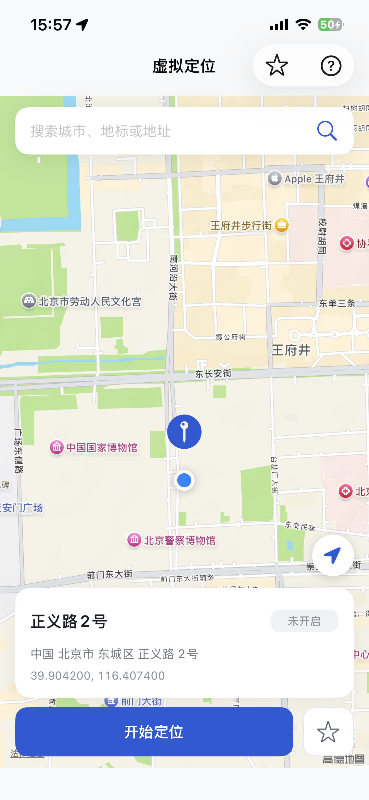
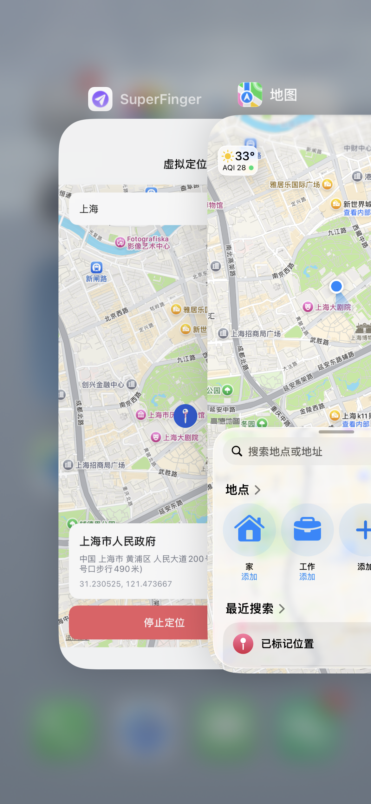
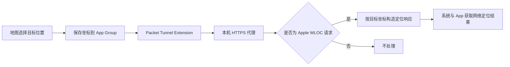

# SuperFinger Location

一款基于 iOS `Packet Tunnel` 与本机 HTTPS 代理实现的实验性网络定位工具。支持原生地图选点、地点搜索、常用位置收藏，以及证书、VPN 和代理环境检测。

**TG 群：[加入 SuperFinger 交流群](https://t.me/+ZTY44CU_J9UyY2M1)**

## 临时体验入口

为方便体验与测试，该功能已临时集成到其他项目中。该 App 的其他功能包含广告，当前定位功能本身无广告，并可能随版本调整或随时下线。长期测试、学习与研究请使用本仓库源码自行编译并完成自签。

- **App Store 最新版本**：[点击前往 App Store](https://apps.apple.com/cn/app/id6749407359)
- **SuperFinger 主项目**：[点击访问 GitHub](https://github.com/Zhuzhen6/SuperFinger)

> [!IMPORTANT]
> 本项目仅用于软件开发、功能测试、隐私研究和个人学习。请勿用于欺诈、考勤作弊、绕过风控或其他违法违规行为。使用前请确认符合当地法律、网络管理规则及相关服务条款。

## 功能特点

| 功能 | 说明 |
| --- | --- |
| 原生地图选点 | 支持拖动地图、地点搜索和当前位置快速定位 |
| 常用位置收藏 | 保存常用地点，方便后续快速切换 |
| 一键启停 | App 内启动或停止定位服务，无需手动配置 Wi-Fi 代理 |
| Packet Tunnel | 通过 `NetworkExtension` 管理目标域名的代理链路 |
| 精准分流 | 仅处理 `gs-loc.apple.com` 和 `gs-loc-cn.apple.com` |
| 配置检测 | 检测系统定位、根证书信任、VPN 授权和本机代理状态 |
| 本地存储 | 选中坐标通过 App Group 在主 App 与 Tunnel Extension 之间共享 |

## 效果预览

<table>
  <tr>
    <th>地图选点与定位控制</th>
    <th>定位效果</th>
  </tr>
  <tr>
    <td></td>
    <td></td>
  </tr>
</table>

## 工作原理



本项目只处理 Apple Wi-Fi、基站等网络定位服务返回的数据，不会直接修改设备的 GPS 硬件数据，也不是通用 VPN 或通用 HTTPS 抓包工具。

实际效果会受到 iOS 版本、GPS 信号、网络环境、系统定位缓存和目标 App 定位策略影响，无法保证所有设备和 App 均能生效。

## 环境要求

- macOS
- Xcode 26 或更高版本
- iOS 16.0 或更高版本
- CocoaPods
- XcodeGen
- 支持 `Network Extensions / Packet Tunnel Provider` 的 Apple Developer Team 与描述文件

## 快速开始

### 1. 获取代码

```bash
git clone https://github.com/Zhuzhen6/SuperFinger-Location.git
cd SuperFinger-Location
```

### 2. 安装工具与依赖

```bash
brew install xcodegen cocoapods
pod install
```

### 3. 准备本地配置

复制配置模板：

```bash
cp Config/Local.xcconfig.example Config/Local.xcconfig
```

在 `Config/Local.xcconfig` 中填写自己的 p12 密码：

```xcconfig
SF_LOCATION_PROXY_IDENTITY_PASSWORD = your-password
```

`Config/Local.xcconfig` 已加入 `.gitignore`，不要将真实密码提交到公开仓库。

### 4. 准备证书

仓库不提供可复用的证书或私钥。请自行生成一套匹配的根证书与代理身份，并放到以下位置：

| 文件 | 路径 |
| --- | --- |
| 根证书 | `SuperFinger/Location/Resources/SuperFingerLocationRootCA.cer` |
| 代理身份 | `SFLocationTunnel/Resources/SuperFingerLocationProxy.p12` |

代理证书需要由对应根证书签发，并覆盖：

- `gs-loc.apple.com`
- `gs-loc-cn.apple.com`

`.cer`、`.p12` 和本地密码配置均不会提交到 Git。请勿复用、传播或公开生产环境私钥。

### 5. 配置签名

在 `project.yml` 中修改：

- `DEVELOPMENT_TEAM`
- 主 App 的 `PRODUCT_BUNDLE_IDENTIFIER`
- Tunnel Extension 的 `PRODUCT_BUNDLE_IDENTIFIER`
- App 与 Tunnel 共用的 App Group

如果修改了 Bundle ID 或 App Group，还需要同步修改 `SuperFinger/Location/Core/SFLocationConfiguration.swift` 中的：

- `kAppGroupIdentifier`
- `kTunnelBundleIdentifier`

请在 Apple Developer 后台为主 App 和 Tunnel Extension 同时启用：

- App Groups
- Network Extensions / Packet Tunnel Provider

两者必须使用同一个 App Group，并由包含对应能力的描述文件签名。

### 6. 生成并打开工程

```bash
xcodegen generate
pod install
open SuperFinger.xcworkspace
```

请选择 `SuperFinger` Scheme 和真机运行。不要直接打开 `SuperFinger.xcodeproj`。

## 构建自签 IPA

完成证书和本地密码配置后执行：

```bash
chmod +x build.sh
./build.sh
```

构建产物：

```text
dist/SuperFinger-Location-unsigned.ipa
```

脚本会执行 XcodeGen、CocoaPods 和无签名 Release 构建，保留 `SFLocationTunnel.appex`，清除残留签名后封装为标准 `Payload` IPA。生成的 `build/` 与 `dist/` 默认不会提交到 Git，可直接从 [GitHub Releases](https://github.com/Zhuzhen6/SuperFinger-Location/releases/latest) 下载已构建的自签版本。

### 自签要求

本项目使用 `NetworkExtension`，不能只重签主 App：

1. 签名工具必须支持 App Extension，并同时重签 `SuperFinger.app` 与 `SFLocationTunnel.appex`。
2. 主 App 和 Extension 需要使用不同的 Bundle ID，Extension 建议使用主 App Bundle ID 加 `.locationTunnel`。
3. 两个 Target 必须使用同一个 App Group。
4. 描述文件必须包含 App Groups 与 `Network Extensions / Packet Tunnel Provider` 权限。
5. 免费 Apple ID 或不支持特殊权限的签名工具通常无法授权 Packet Tunnel，可能出现“VPN 配置未授权”或 Extension 无法启动。

> [!WARNING]
> 自签 IPA 会包含项目运行所需的根证书和 p12 代理身份。公开发布前请使用专门的分发证书，禁止替换为生产环境或其他业务共用的私钥。

## 使用方法

首次启动需要完成一次环境配置：

1. 在 App 中下载根证书。
2. 打开“设置 → 通用 → VPN 与设备管理”，安装描述文件。
3. 打开“设置 → 通用 → 关于本机 → 证书信任设置”，为根证书开启完全信任。
4. 返回 App，点击“检测证书与 VPN”。
5. 首次检测时，允许 SuperFinger 添加 VPN 配置。
6. 检测通过后，在地图中搜索或拖动选择位置。
7. 点击“开始定位”，再打开地图或目标 App 验证。

需要恢复真实位置时，在 App 中点击“停止定位”。如果系统仍显示旧位置，可尝试彻底关闭目标 App、重新开关系统定位服务，必要时重启设备以清理定位缓存。

## 项目结构

```text
SuperFinger/Location/
├── Controller/    地图、收藏、配置引导和说明页面
├── Core/          配置、证书、坐标转换与共享状态
├── Model/         地点和收藏数据模型
├── Proxy/         HTTPS 代理与 WLOC 响应处理
├── Resources/     根证书放置目录
├── Service/       VPN、证书下载服务与环境检测
└── View/          定位模块 UI 组件

SFLocationTunnel/
├── PacketTunnelProvider.swift
├── SFLocationTunnelService.swift
└── Resources/     p12 代理身份放置目录
```

## 常见问题

### 提示“VPN 配置未授权”

请依次检查：

1. 主 App 与 Tunnel Extension 是否都启用了 `Packet Tunnel Provider` 能力。
2. 两个 Target 是否使用同一个 Apple Developer Team 和 App Group。
3. 实际签名使用的描述文件是否包含 `com.apple.developer.networking.networkextension` 权限。
4. 删除设备中旧的 SuperFinger VPN 配置与旧 App，重新安装后再次授权。

### 安装时报 `AppexBundleMissingNSExtensionDict`

确认 `SFLocationTunnel/Info.plist` 中包含完整的 `NSExtension` 配置，然后重新生成工程：

```bash
xcodegen generate
pod install
```

### 提示根证书未信任

只安装描述文件还不够，还需要进入“设置 → 通用 → 关于本机 → 证书信任设置”，手动开启完全信任。

### VPN 已连接但位置没有变化

- 确认证书与 p12 来自同一套证书链，p12 密码配置正确。
- 确认当前选点已经保存，并保持定位 VPN 连接。
- 室外 GPS 信号较强时，系统或目标 App 可能优先使用真实 GPS。
- 较新的 iOS 版本可能缓存旧定位结果，可重新开关定位服务或重启设备。
- 部分 App 使用独立风控、传感器融合或自有定位服务，本项目不保证兼容。

## 安全说明

- 本项目需要在测试设备上安装并完全信任自签根证书，请只使用自己生成和保管的证书。
- 不要将 `.p12`、私钥、真实密码或签名配置提交到公开仓库。
- 不要安装来源不明的根证书，也不要向他人提供自己的代理身份文件。
- 建议仅在自有设备和可控测试环境中使用，测试结束后可停止 VPN 并移除不再需要的根证书。

## 交流与反馈

- **TG 群：[https://t.me/+ZTY44CU_J9UyY2M1](https://t.me/+ZTY44CU_J9UyY2M1)**
- 反馈问题时，请附上 iOS 版本、设备型号、复现步骤和已脱敏日志。

## 参考项目

感谢以下开源项目提供思路与实现参考：

- [Yu9191/wloc](https://github.com/Yu9191/wloc)
- [xweiba/location-spoofer](https://github.com/xweiba/location-spoofer)
- [OpenHRTT/wloc](https://github.com/OpenHRTT/wloc)

本项目的代码结构、功能范围和实现细节以当前仓库为准，不代表上述项目。
